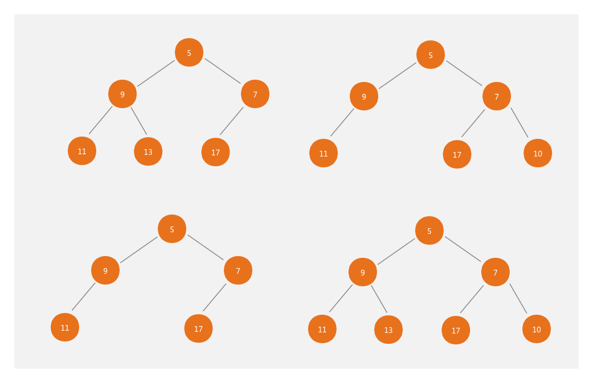
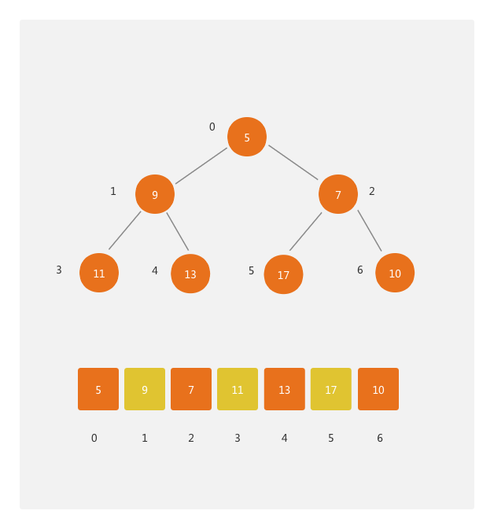

# 最小堆定义
- 堆是一个完全二叉树。
- 堆中每一个节点的值都必须小于等于其子树中每个节点的值

## 完全二叉树
这里先看下完全二叉树的定义：
***除了最后一层，其他层的节点个数都是满的，最后一层的节点都靠左排列***

## 最小堆
到这里可能有人要问了，react里的任务队列定义的是数组啊。那就对了，因最小堆这种数据结构最适合的存储方式就是数组，见下图：

从图中我们可以总结出如下公式，已知数组中的某个节点下标为 i，则该节点的(以下的计算结果皆向下取整)：
- 左子节点下标为 2(i+1) - 1
- 右子节点下标为 2(i + 1) 
- 父节点下标为 (i - 1) / 2

