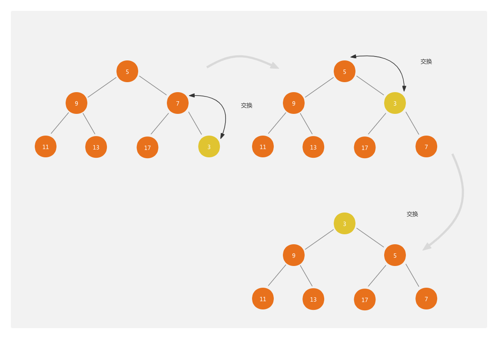
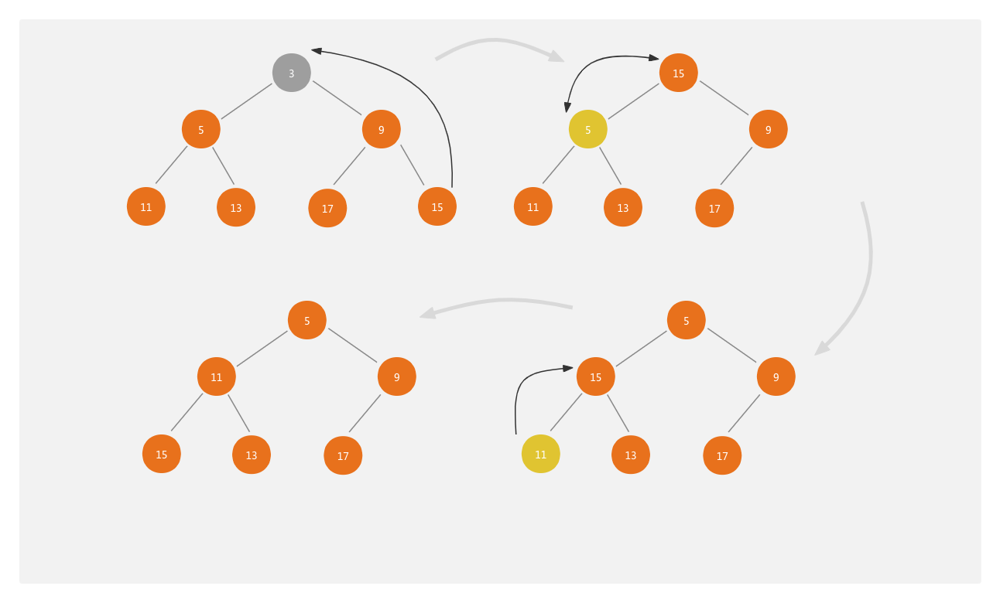
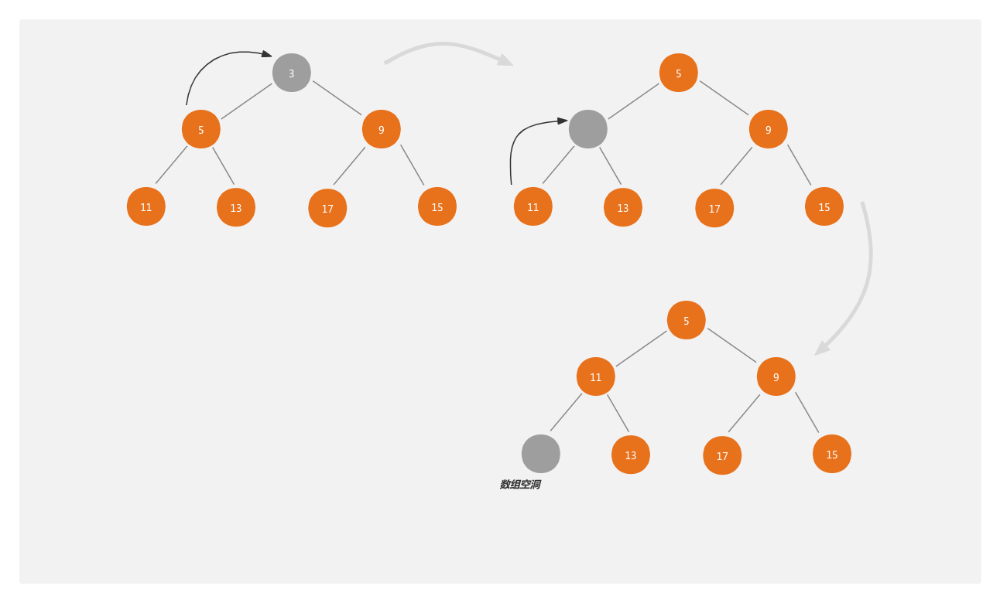

# React中最小堆源码实现
react的任务池用数组来存储任务，那肯定就会有一个存的方法（push），而数组存的是最小堆的数据结构，所以存的时候就会有一个堆化的过程，这个时候是从下往上的堆化（siftUp）；而在执行的时候，需要取出堆顶的任务（peek）, 当取出的任务执行完成后，从堆顶删除（pop）此任务，然后在执行一个从上往下的堆化（siftDown）；

## push
往最小堆中添加一个任务



**源码实现如下**
```ts{4}
export function push(heap: Heap, node: Node): void {
  const index = heap.length;
  heap.push(node);
  siftUp(heap, node, index);
}
```
**siftUp（由下往上堆化）**
```ts{4}
function siftUp(heap, node, i) {
  let index = i;
  while (index > 0) {
    const parentIndex = (index - 1) >>> 1;
    const parent = heap[parentIndex];
    if (compare(parent, node) > 0) {
      // The parent is larger. Swap positions.
      heap[parentIndex] = node;
      heap[index] = parent;
      index = parentIndex;
    } else {
      // The parent is smaller. Exit.
      return;
    }
  }
}
```

## peek
**获取最小堆的堆顶值**
```ts{4}
export function peek(heap: Heap): Node | null {
  return heap.length === 0 ? null : heap[0];
}
```

## pop
删除堆顶的任务



**源码实现如下**
```ts{4}
export function pop(heap: Heap): Node | null {
  if (heap.length === 0) {
    return null;
  }
  const first = heap[0];
  const last = heap.pop();
  if (last !== first) {
    heap[0] = last;
    siftDown(heap, last, 0);
  }
  return first;
}
```
**siftDown（由上往下堆化）**
```ts{4}
function siftDown(heap, node, i) {
  let index = i;
  const length = heap.length;
  const halfLength = length >>> 1;
  while (index < halfLength) {
    const leftIndex = (index + 1) * 2 - 1;
    const left = heap[leftIndex];
    const rightIndex = leftIndex + 1;
    const right = heap[rightIndex];

    // If the left or right node is smaller, swap with the smaller of those.
    if (compare(left, node) < 0) {
      if (rightIndex < length && compare(right, left) < 0) {
        heap[index] = right;
        heap[rightIndex] = node;
        index = rightIndex;
      } else {
        heap[index] = left;
        heap[leftIndex] = node;
        index = leftIndex;
      }
    } else if (rightIndex < length && compare(right, node) < 0) {
      heap[index] = right;
      heap[rightIndex] = node;
      index = rightIndex;
    } else {
      // Neither child is smaller. Exit.
      return;
    }
  }
}
```

## pop一个小知识点补充
pop时，为啥要把队尾的任务换到堆头，直接删除队头后在堆化不行吗？


